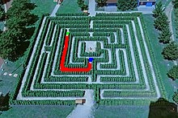

# Fall 2021 - ICV Project repository

## Hedge Maze Solving with CV

**Authors:**

* Dmitry Podpryatov
* Rufina Sirgalina

## Structure

[Main.ipynb](Main.ipynb) implements a full pipeline starting from the RGB image to the preprocessing, mazes solving, and
to the path drawing

[Test.ipynb](Test.ipynb) contains tests for maze solvers

[algorithms](algorithms) contains maze solvers and a base class

[utils](utils) contains auxiliary methods for plotting and cropping images

[images](images) contains pictures of natural mazes

[images/test](images/test) contains generated pictures for testing purposes

[images/cropped](images/cropped) contains pictures with cropped out mazes from the [./images](images) folder

[images/solutions](images/solutions) contains pictures with drawn solution path

## Colors

* **Green** - start
* **Red** - path
* **Blue** - finish



## Linter

```bash
pip install flake8

# To run linter
flake8
```
